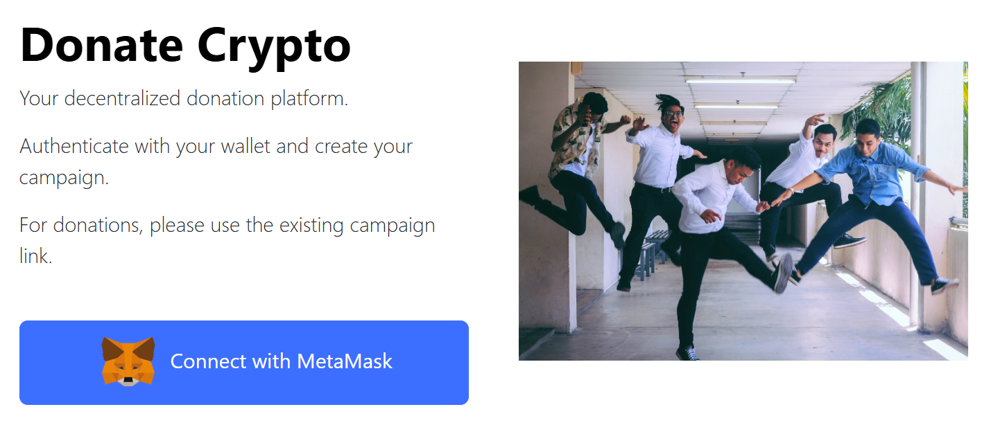

# web23-donate-crypto

Donations platform (profit)

    

Projects from Web3 para Iniciantes' course [by LuizTools](https://cursos.luiztools.com.br/cursos/web3-para-iniciantes/)

## smart-contract

My Donate Crypto web3 smart contract

Demo available in [https://sepolia.etherscan.io/address/0x53C3c73D37f6F3073447167e755d38368DD8089D](https://sepolia.etherscan.io/address/0x53C3c73D37f6F3073447167e755d38368DD8089D)

### How to smart-contract

1. open https://remix.ethereum.org
2. create a new DonateCrypto.sol file 
3. copy and paste the [content](./smart-contract/DonateCrypto.sol) from repo
4. build & deploy
5. verify and Publish
6. test
7. get ABI

## dapp

My Donate Crypto web3 frontend.

Demo available in [https://web23-donate-crypto.vercel.app/](https://web23-donate-crypto.vercel.app/)

## How to local run

1. git clone dapp
2. npm install
3. change contract address at services/Web3Service.js and ABI.json
4. npm run dev
5. access by http://localhost:3000/

## License

Code released under the [MIT License](./LICENSE).

Make by [Leonardo Cairo](https://www.linkedin.com/in/leocairos/)!